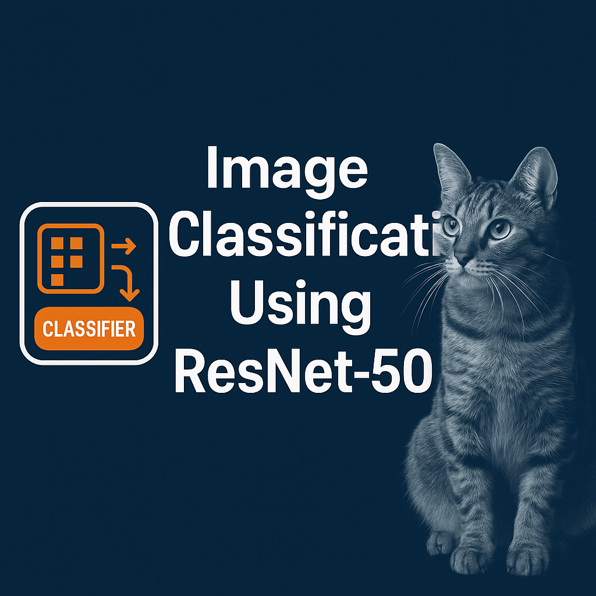
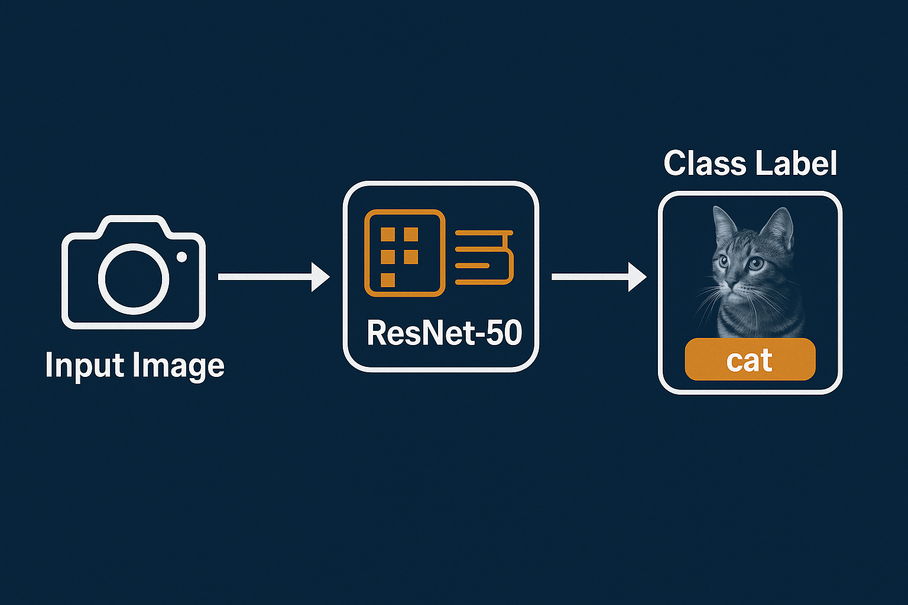
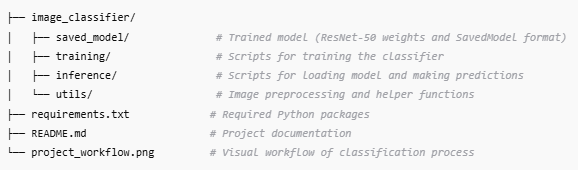

## 🧠 Image Classification Using ResNet-50

This project demonstrates an image classification pipeline using the powerful ResNet-50 deep learning architecture. The model is trained to classify images into various categories with high accuracy, leveraging the strength of **residual learning** for improved performance on complex visual tasks.

  

### 🚀 Key Features

    ✅ Utilizes ResNet-50, a 50-layer deep convolutional neural network.
    📦 Handles image preprocessing, augmentation, and normalization.
    📁 Trained model saved in SavedModel and .h5 formats.
    📊 Includes training metrics visualization and evaluation logic.
    🖼️ Easily test predictions on new/unseen images.

### ⚙️ Project architecture

  

### 📂 Project Structure

  

### 🧪 How It Works

    Input: Upload an image (e.g., of an animal, object, or scene).

    Model: Passes through the ResNet-50 architecture pretrained on ImageNet or fine-tuned on custom data.

    Output: The predicted class label (e.g., "cat", "dog", "car") with confidence score.

### 🔧 Setup & Installation

#### Clone the repository
`git clone https://github.com/anulsasidharan/Image-Classification-Using-resnet50.git`

`cd Image-Classification-Using-resnet50`

#### Create virtual environment (optional)
`python -m venv venv`

`source venv/bin/activate  # or venv\Scripts\activate on Windows`

OR, If we are using conda

`conda create -p venv python=3.10`

`conda activate venv/`

#### Install dependencies
`pip install -r requirements.txt`

### Running the Streamlit app

`streamlit run app.py`

### 📌 Notes
⚠️ Large model files (e.g., .h5 or TensorFlow SavedModel) are not included in this repo due to GitHub's size limits. 
Create a folder called `saved_model` and then run the `main.py` file to create the model for the tensorflow app. Once it is in place, run the streamlit app. 

For the training and validation images, Create the folders `dataset/train/` and `dataset/val/` and place each dataset in its own class directories. For example, for `cat`, create
a folder inside both `train` and `val` directory and place 70% of data in the `../train/cat/` and 30% images in the `../val/cat/` respective class directories before doing the model creation. 